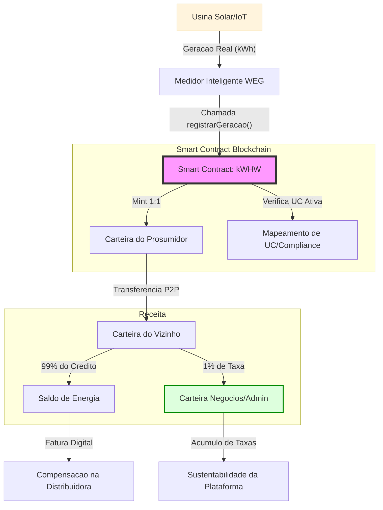

# ⚡ Energy Link (V6.0)
### Gestão de Créditos de Energia Solar via Smart Contract

Este projeto foi desenvolvido para automatizar a gestão, auditoria e transferência de créditos de energia solar distribuída. O sistema utiliza a tecnologia Blockchain para garantir que cada kWh gerado seja registrado de forma imutável e vinculada a uma Unidade Consumidora (UC) real.

## 🚀 O que este projeto resolve?
No modelo atual de geração distribuída, o rateio de créditos costuma ser manual e burocrático. O **WEG Energy Link** resolve isso através de:

- **Transparência Total:** Auditoria em tempo real de geração e consumo sem necessidade de planilhas.
- **Monetização Automatizada:** O sistema retém uma taxa de 1% em cada transação para sustentar a operação da rede.
- **Compliance ANEEL:** Cada carteira digital é vinculada a uma Unidade Consumidora (UC), atendendo às normas de identificação de beneficiários.
- **Previsibilidade Financeira:** Conversão instantânea de kWh para Reais baseada na bandeira tarifária atual.

## 🛠️ Pilares Técnicos
- **Padrão ERC-20:** Facilidade de integração com outras carteiras e sistemas digitais.
- **Oracle de Preço:** Função dedicada para o Administrador atualizar o valor do kWh.
- **Logs de Auditoria:** Eventos de "Fatura Gerada" registrados diretamente na rede para exportação.

## 📝 Como testar (Remix IDE)
1. Importe o arquivo `creditoEnergia.sol` no [Remix IDE](https://remix.ethereum.org).
2. Compile utilizando a versão de Solidity `0.8.20`.
3. No Deploy, utilize o endereço do Administrador para gerenciar as taxas e cadastrar as UCs.
4. Utilize a função `cadastrarUnidadeConsumidora` antes de realizar transferências para garantir o compliance.

---
**Desenvolvido por:** [filhormnilton](https://github.com/filhormnilton)  
**Localização:** Jaraguá do Sul, SC - Brasil
